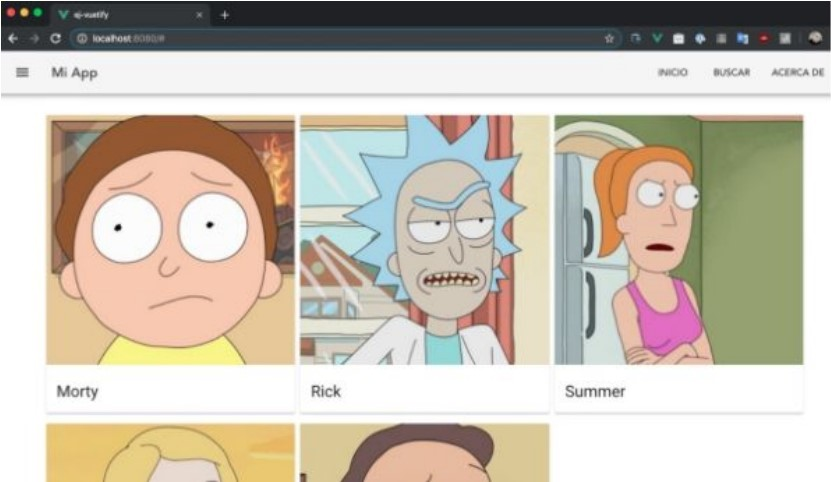
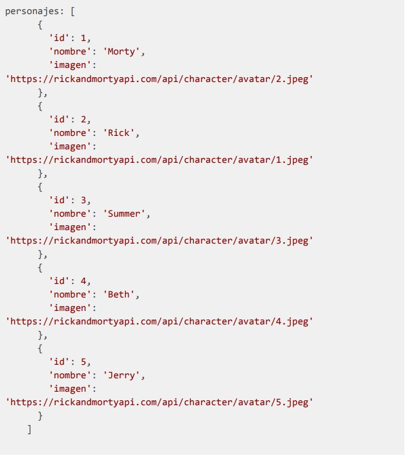

# 5_3-layout-vuetify

## Descripción

Para el siguiente desafío se debe seleccionar uno de los frameworks de UI y escribir el
código necesario para producir el siguiente layout:

Como características primordiales se requiere que:

- Posea una barra de navegación superior.
- Una sección principal (grilla) con 3 columnas de elementos
- Un contenedor para dichos elementos, puede ser uno propio o se pueden usar
  componentes como cards
- Cada elemento debe poseer una imagen, un nombre.

Para facilitar el desarrollo y enfocarse solamente en el uso de los componentes del
framework UI escogido, no tiene porque trabajar en una vista diferente, puedes incluir toda la
vista en el archivo App.vue con los estilos, datos y métodos que estimes convenientes.

## Instrucciones

1. Una vez creado un proyecto de Vue se debe integrar alguno de los frameworks
   mencionados en el capítulo: BootstrapVue, Vuetify, Buefy, ElementUI.

1. Implementación del layout requerido: Barra de navegación, grilla con 3 columnas,
   elementos contenidos en un componente apropiado y la visualización de los datos
   de este componente (imagen, nombre).

El contenido mostrado como “producto”, debe ser cargado dinámicamente, esto significa
que puede ser obtenido desde algún recurso externo, un archivo .json o simplemente
definido como una variable dentro de los datos de Vue. De escoger el último método, la
variable debe ser un array de objetos.

## Recursos

Este puede ser el ejemplo de los datos a utilizar:

