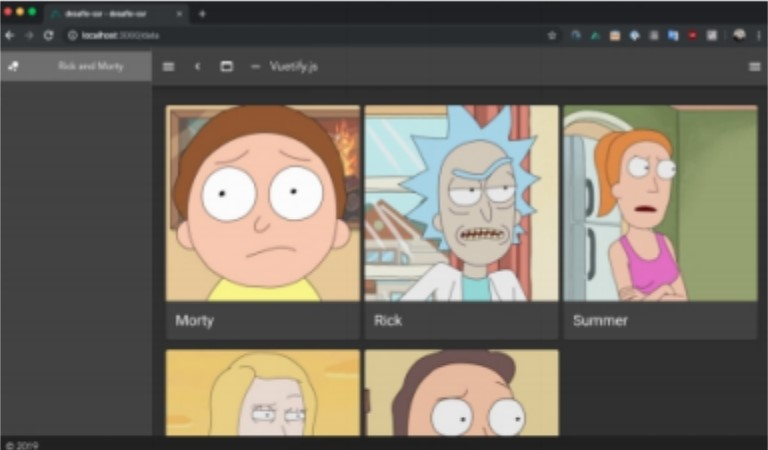
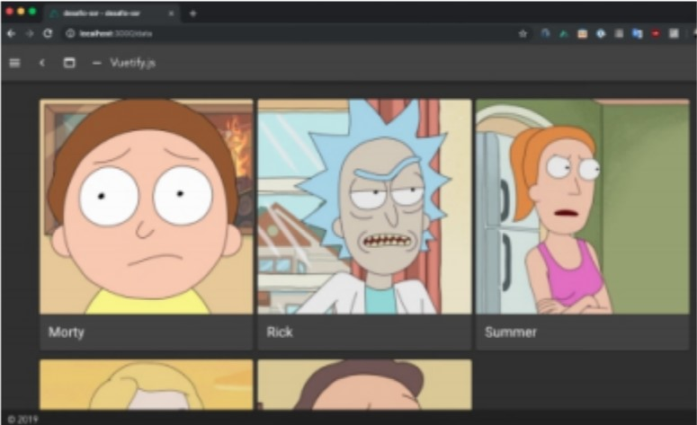

# 5_4-Desarrollo en frameworks de Vue

## Descripción

Al haber conocido las ventajas que ofrecen los frameworks, es necesario poner en práctica
los conocimientos desarrollados para ello. Se le pide desarrollar la siguiente aplicación
simple:

## Requisitos

- Debes utilizar un framework de UI.
- La aplicación DEBE ser renderizada por el servidor (SSR), por lo que se debe utilizar Nuxt.js
- El layout desarrollado queda a libertad de usted, sin embargo, deben existir al menos 1 vista:
  - Vista con las tarjetas de los personajes, con los detalles más importantes de estos.
- La navegación debe ser mediante VueRouter (integrado en Nuxt.js).

## Instrucciones

1. Crear un proyecto con Nuxt.js y utilización de framework UI.
1. Desarrollar vistas utilizando el framework de UI seleccionado y navegación con VueRouter.

Renderizar por parte del Servidor (SSR).
